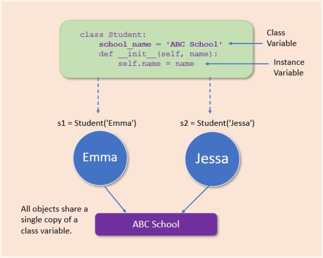
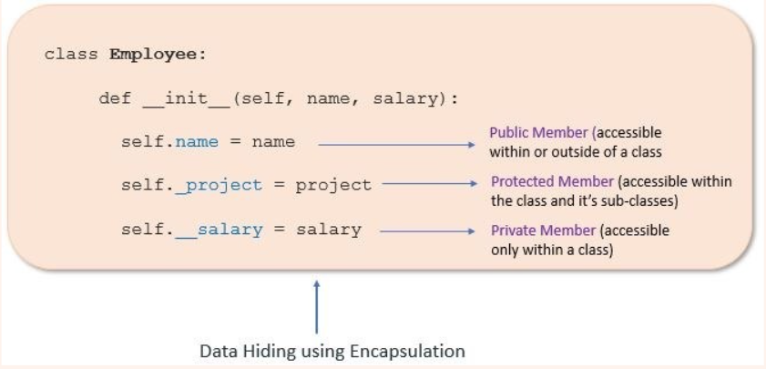
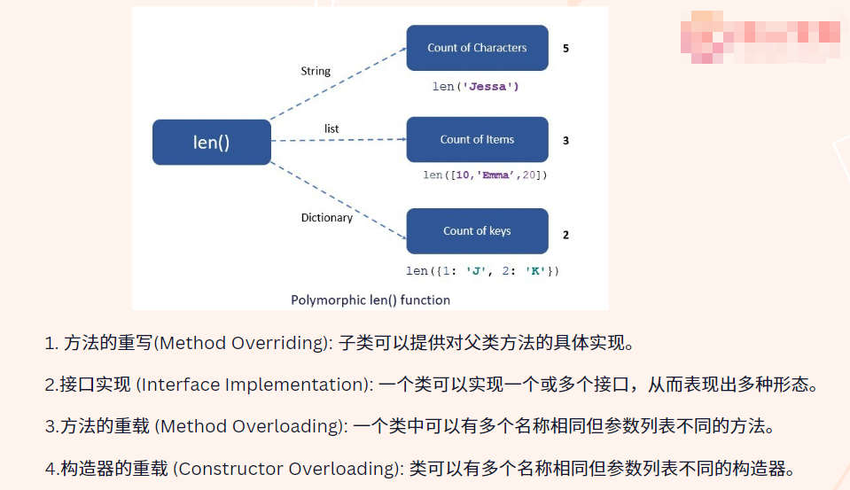

- [Note](#Note)
  - [Python_6 (`24/01/2024`)](#Python_6-24012024)
    - [Python的装饰器](#Python的装饰器)
    - [面向对象(OOP)](#面向对象OOP)
      - [类和对象](#类和对象)
        - [Class - Instance Variable](#Class-Instance-Variable)
        - [封装（Encapsulation）](#封装Encapsulation)
        - [继承（Inheritance）](#继承Inheritance)
        - [多态（Polymorphism）](#多态Polymorphism)

# Note
 
## Python_6 (`24/01/2024`)

### Python的装饰器
- 概念：允许你再不修改原有函数代码的情况下，增加额外的功能
- 装饰器(Decorator)本质上是一个函数，可以接受一个函数作为参数，并返回一个新的函数
- input wrapper示例

 

 

- output wrapper示例(此时注意需要call两次才能生效)

 

 

- @decorator的一些用法

 

 

- decoratorde 可能的实际应用场景

 

### 面向对象(OOP)
- 定义：是一种编程范式，使用“对象”来设计软件。在这种范式中，对象是数据和与之相关的方法的集合
- 目的：促进更灵活和可维护的代码，并支持代码复用和封装
- 核心概念：

#### 类和对象
- 类（Class）：类是创建对象的蓝图或原型，它定义了对象的数据和行为
- 对象（Object）：对象是类的实例，一个类可以实例化成多个对象，每个对象都有类中定义的属性和方法
- stateful vs stateless：
  | 有状态(stateful) | 无状态(stateless)
  | :---: | :---:
  | 维护着一些信息 | 不保留任何之前操作的信息或结果
  | 同一操作的多次调用可能会因为对象的状态不同而产生不同的结果 | 着每次调用都是独立的
  | 更复杂、更消耗资源 | 更简单，易于理解和维护

  
##### Class - Instance Variable
- Class和Instance的引用分开独立，通过修改Instance的attribute不会影响Class的内容

 

 

#### 封装（Encapsulation）
- 封装是将对象的数据（属性）和行为（方法）捆绑在一起的过程
- 封装还包括了信息隐藏的概念，即从外部代码隐藏内部数据和实现细节
- 这通常是通过访问（如public、private、protected）来实现的
- 实例：
 

 

*不带下划线的调用称为public member，可在class内外调用*
 
*带一个下划线叫做protected member，只能在class内及自己的sub-class调用*
 
*带两个下划线叫做private member，只能在class内的sub-class调用*
 

- Methods
| 实例方法（Instance Method）| 类方法（Class Method）| 静态方法（Static Method）
| :---: | :---: | :---:
| 绑定到类的具体实例（对象）上 | 绑定到类本身上，而不是类的实例 | 绑定到类上，但它们与类没有直接的交互
| 可以读取或者修改对象的状态 | 可以修改类变量，但不能直接修改实例变量 | 既不能访问实例变量，也不能访问类变量
| 可以访问类中定义的实例变量和类变量 | 只能访问类变量，不能访问与类的某个具体实例相关的实例变量 | 不能访问类的实例变量和类变量

#### 继承（Inheritance）
- 继承是一种基于现有类创建新类的机制
- 新创建的类成为“子类”（或派生类），现有类称为“父类”（或基类）
- 子类继承父类的属性和方法，可以添加新的属性和方法或者重写现有的方法

#### 多态（Polymorphism）
- 多态市值允许使用不同类型的对象以相同的方式进行操作
- 通常是通过重写（overriding，用于继承中）
- 重载（overloading，用于方法中参数数量或类型不同）

 

 

