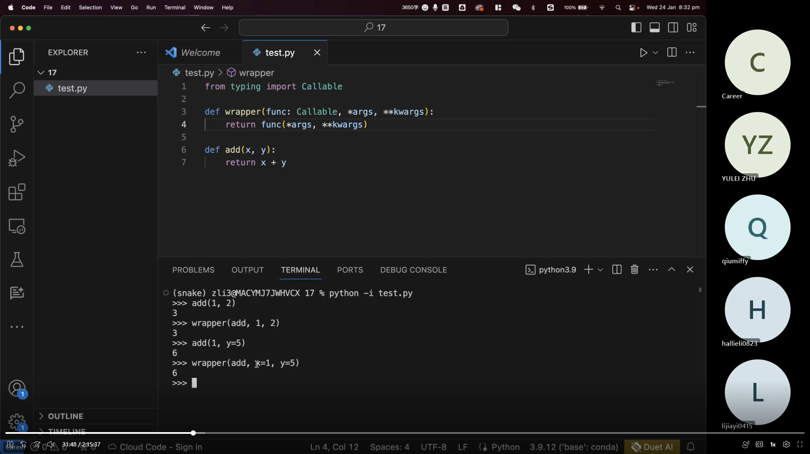
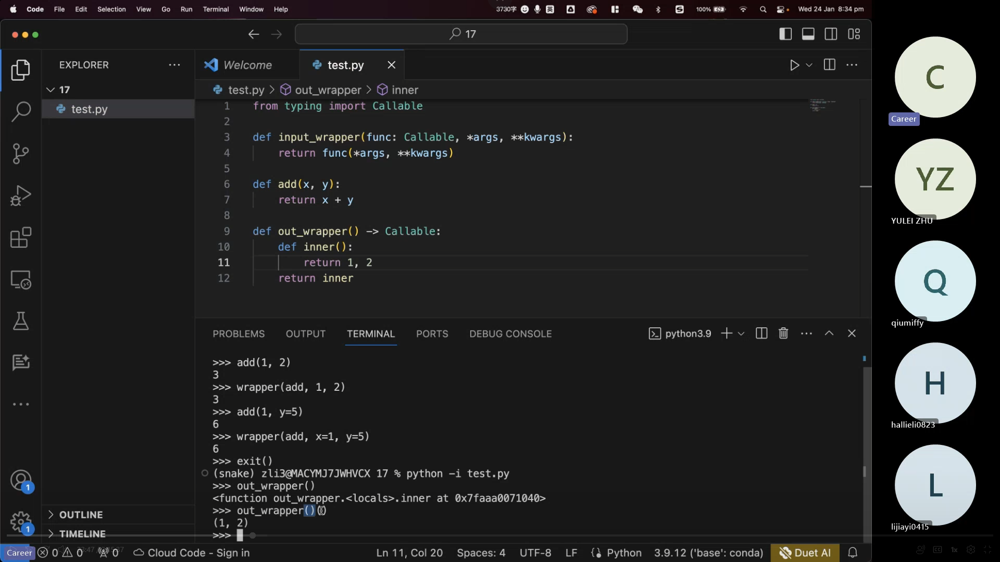
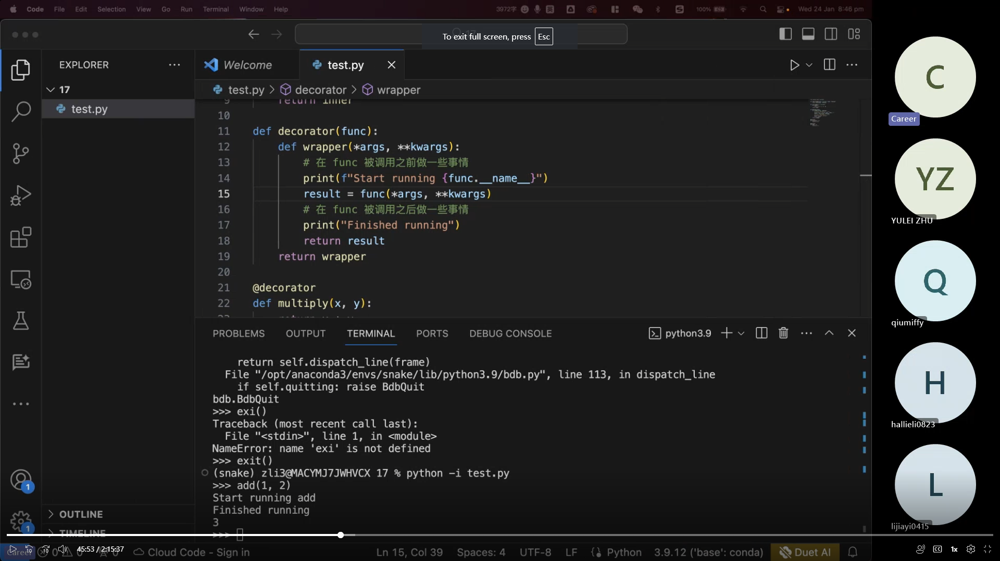
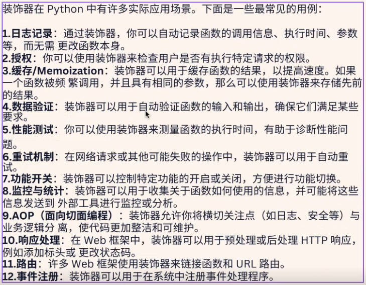

# Note
 
## Python_6 (`24/01/2024`)

### Python的装饰器
- 概念：允许你再不修改原有函数代码的情况下，增加额外的功能
- 装饰器(Decorator)本质上是一个函数，可以接受一个函数作为参数，并返回一个新的函数
- input wrapper示例

 

 

- output wrapper示例(此时注意需要call两次才能生效)

 

 

- @decorator的一些用法

 

 

- decoratorde 的实际应用场景

 

